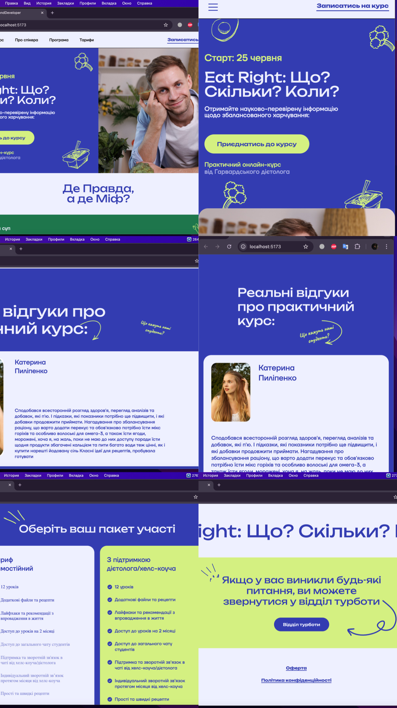
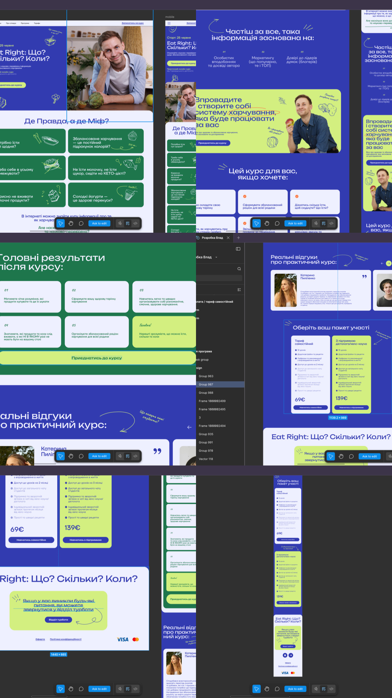

# 🚀 SaaS Landing Page — Modern & Responsive

### 📝 О проекте

Современный, чистый лендинг для SaaS-платформы. Фокус на производительности, семантике и идеальном отображении на всех устройствах. Проект выполнен в рамках интенсивного обучения фронтенд-разработке.

### 🛠 Стек технологий:

- **HTML5** — семантическая разметка для SEO и доступности.
- **SCSS** — продвинутая стилизация (BEM, переменные, миксины).
- **Mobile First** — адаптивная верстка, начиная с мобильных разрешений.
- **JavaScript** — 
- **VITE** — сборщик пакетов.

---

### 📱 Демонстрация интерфейса

#### Анимация работы

<table width="100%">
  <tr>
    <td width="50%"></td>
    <td width="50%"></td>
  </tr>
</table>

#### Основные блоки

<table width="100%">
  <tr>
    <td width="50%"></td>
    <td width="50%"></td>
  </tr>
</table>

---

### 🚀 Как запустить

1. **Посмотреть онлайн:** [Live Demo](https://vladzvezdaev-ops.github.io/first-pro-landing/)
2. **Клонировать репозиторий:**
   ```bash
   git clone https://github.com/vladzvezdaev-ops/first-pro-landing.git
   ```
